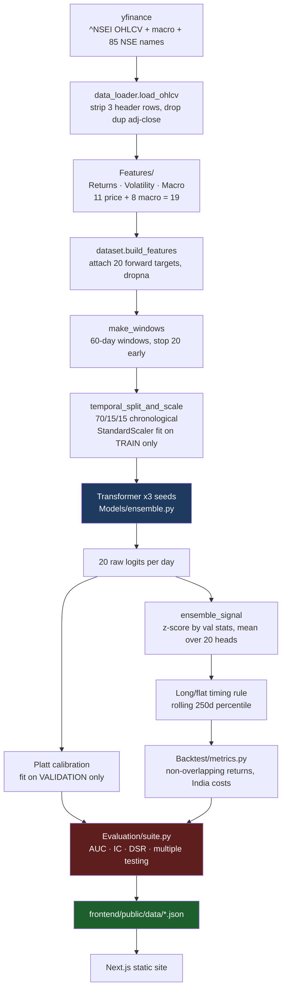
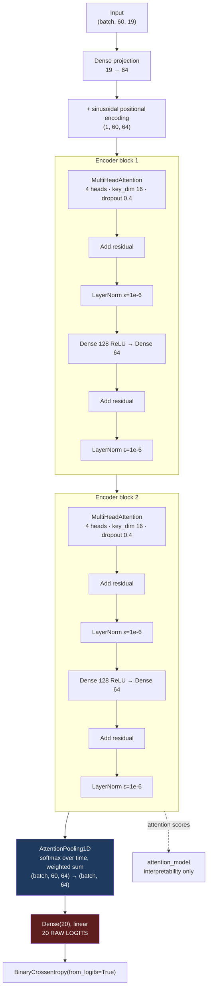
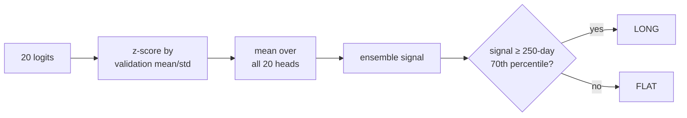
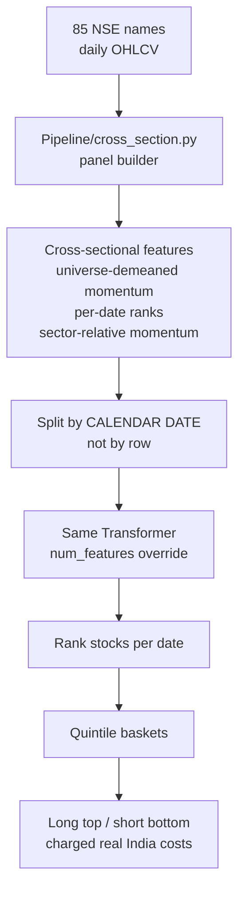

# 4. Architecture

## System pipeline



## Model architecture



### Parameters

| Component | Setting | Rationale |
|-----------|---------|-----------|
| `d_model` | 64 | Small — 3k training windows cannot support a large model |
| `num_heads` | 4 | key_dim = 64/4 = 16 per head |
| `ff_dim` | 128 | 2x d_model, standard ratio |
| `num_layers` | 2 | Deeper overfits at this sample size |
| `dropout` | 0.4 | High, validation-selected. The main overfitting control |
| `pooling` | attention | Learned weighting over timesteps |
| Output | Dense(20) linear | Raw logits |
| Loss | BCE `from_logits=True` | Numerically stable |
| Optimizer | Adam, lr 3e-4 | Validation-selected |

Roughly 120k parameters against ~3,000 training windows. The dropout of 0.4 plus
early stopping (patience 7, best weights restored) does the regularisation work.

## Three design decisions worth understanding

### 1. Attention pooling, not global average pooling

Global average pooling discards the ordering that the positional encoding just
injected. Attention pooling learns which timesteps matter:

```python
@tf.keras.utils.register_keras_serializable(package="mht")
class AttentionPooling1D(tf.keras.layers.Layer):
    def __init__(self, **kwargs):
        super().__init__(**kwargs)
        self.score = tf.keras.layers.Dense(1)

    def build(self, input_shape):
        self.score.build(input_shape)   # else unbuilt at save time
        super().build(input_shape)

    def call(self, x):
        w = tf.nn.softmax(self.score(x), axis=1)   # (B, T, 1) over time
        return tf.reduce_sum(x * w, axis=1)        # (B, C)
```

**This must stay a registered `Layer`, never a `Lambda`.** Keras refuses to
deserialize a `Lambda` wrapping a Python lambda, which makes `model.save()` raise
and therefore makes optimizer state unsaveable. The inner `Dense` must be built
in `build()` — otherwise it is unbuilt at save time and its weights silently fail
to restore, producing a model that loads without error and predicts nonsense.

Changing this invalidates existing `.weights.h5` files. Re-run
`scripts/save_paper_model.py`.

### 2. Raw logits everywhere

The model outputs raw logits. `tf.sigmoid` is applied only at inference for
display. The logits themselves are the alpha signal, because their *magnitude*
carries confidence information that a thresholded probability throws away.

### 3. Seed ensembling

GPU `MultiHeadAttention` is not fully deterministic. Training 3 seeds and
averaging their predictions collapses run-to-run variance and improves
generalisation slightly. `training.n_seeds: 3`.

## Signal construction



Z-scoring uses **validation** statistics so no test information enters signal
construction. All 20 heads are used rather than h=20 alone — averaging reduces
variance.

The threshold rule is *rolling and past-only*: the 70th percentile is computed
over the trailing 250 days, never the full sample. A fixed threshold fit on
validation was tried first and turned out degenerate on test (see
[Data, rule 6](03-data.md#6-everything-selected-on-validation)).

## Cross-sectional track



Targets are **relative**: does this stock beat the universe median over `h` days?
This neutralises market beta, forcing the model to find relative information.

Config `cross_section.objective` switches between `classification` (beat-median
labels) and `regression` (continuous excess log-return, Huber loss). The head
stays `Dense(20)` linear in both cases; only the loss changes. Classification is
primary — regression underperformed (IC −0.012).

Continue to [File Reference](05-file-reference.md).
