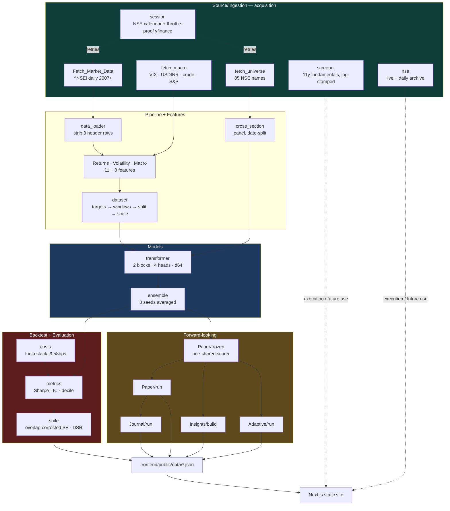

# 5. File Reference

Every module: what it does, how to run it, and why it exists.
**51 modules, ~8,100 lines**, plus a 987-line test suite.

## System flow



## Repository layout

```
.
├── config.yaml                 # ALL hyperparameters. Nothing hardcoded elsewhere.
├── Source/
│   ├── device.py               # GPU/CPU selection, fail-fast on CPU
│   ├── Ingestion/              # 8 modules: acquisition + live routing
│   ├── Features/               # Returns, Volatility, Macro
│   ├── Pipeline/               # loading, windowing, splitting, scaling
│   ├── Models/                 # Transformer + seed ensemble
│   ├── Backtest/               # costs, metrics, orchestrators
│   ├── Evaluation/             # metric suite + registry
│   ├── Paper/                  # live forward paper trading
│   ├── Insights/               # current predictions artifact
│   ├── Adaptive/               # drift, versioning, gated retraining
│   ├── Journal/                # P&L attribution + Thompson bandit
│   ├── Intraday/               # hourly track
│   ├── Advisor/                # optional LLM commentary (off)
│   ├── Risk/                   # volatility-targeted sizing
│   ├── News/                   # GDELT + FinBERT sentiment
│   └── Api/                    # read-only FastAPI over artifacts
├── scripts/                    # runnable entry points
├── tests/test_rigorous.py      # 58 tests
├── Data/                       # raw + processed
├── frontend/                   # Next.js static site
└── Documentation/              # you are here
```

---

## `Source/Ingestion/` — acquisition (8 modules, 835 lines)

| File | Lines | Purpose |
|------|-------|---------|
| `session.py` | 120 | **NSE trading calendar** (holidays, not just weekends) + `download()`, a throttle-resistant yfinance client |
| `Fetch_Market_Data.py` | 33 | `^NSEI` daily OHLCV → the multi-header CSV `load_ohlcv` parses |
| `fetch_macro.py` | 52 | India VIX, USDINR, crude, S&P 500 → `Data/Raw_Data/Macro/` |
| `fetch_universe.py` | 42 | 85 NSE large caps (gitignored). **Simple single-header CSV**, unlike the `^NSEI` export |
| `screener.py` | 325 | **Point-in-time fundamentals** — 11y annual, 13q quarterly, FII/DII. Every row lag-stamped |
| `nse.py` | 232 | Authoritative NSE fundamentals + `delivery_pct`. Archives dated snapshots |
| `quotes.py` | 174 | Live quote routing: NSE for spot, yfinance for price. **Execution-side only** |

Two traps encoded here, both from real failures:

- **Yahoo returns an empty body when throttled**, and yfinance caches that
  emptiness on the client, so retrying the same object re-reads nothing.
  `download()` builds a fresh session per attempt and **raises** rather than
  returning empty — a silent empty frame becomes a silent gap in a training set.
- **Screener gives period labels, not announcement dates.** `point_in_time()`
  filters on `available_from`; filtering on `period` is look-ahead leakage.

Full routing rationale: [Data Sources](13-data-sources.md).

## `Source/Features/` — feature engineering (3 modules, 196 lines)

| File | Lines | Produces |
|------|-------|----------|
| `Returns.py` | 47 | `daily_ret`, `roll_mean_ret_{5,10,20}`, `momentum_10`, `ma_diff_10` |
| `Volatility.py` | 53 | `roll_vol_{5,10,20}`, `log_volume`, `vol_roll_mean_5` |
| `Macro.py` | 96 | The 8 macro features. **Enforces the strict lag** via `_asof_lagged` |

## `Source/Pipeline/` — data to tensors (3 modules, 543 lines)

| File | Lines | Key functions |
|------|-------|---------------|
| `data_loader.py` | 53 | `load_ohlcv` — strips 3 header rows and the duplicate adj-close |
| `dataset.py` | 153 | `build_features`, `make_windows`, `temporal_split_and_scale`, `resolve_feature_cols` |
| `cross_section.py` | 337 | Panel builder, date-based split, cross-sectional features, `latest_windows` |

`resolve_feature_cols(cfg)` **raises if a column appears twice** — macro listed
under both `use_macro` and `xs_features` silently double-weighted a signal. Tested.

## `Source/Models/` (2 modules, 176 lines)

| File | Lines | Contents |
|------|-------|----------|
| `transformer.py` | 127 | `AttentionPooling1D`, `positional_encoding`, `_encoder_block`, `build_model`, `compile_model` |
| `ensemble.py` | 49 | `train_ensemble` — N seeds, averaged predictions |

## `Source/Backtest/` (4 modules, 1,161 lines)

| File | Lines | Contents |
|------|-------|----------|
| `costs.py` | 105 | India cost model — `INSTRUMENTS`, `india_cost_breakdown` |
| `metrics.py` | 307 | Sharpe, drawdown, IC, decile attribution, `calibrate_probs` |
| `run.py` | 453 | Index-track orchestrator → ~15 JSON artifacts |
| `run_cross_section.py` | 296 | Panel train + quantile spread |

Round-trip: **futures 9.58bps** (used), intraday 10.47, options 25.53, delivery 28.22.

## `Source/Evaluation/` (2 modules, 296 lines)

| File | Lines | Contents |
|------|-------|----------|
| `suite.py` | 233 | `_auc_se` (overlap-corrected), `auc_pvalue`, `deflated_sharpe`, `multiple_testing`, `diebold_mariano`, `friedman_test` |
| `registry.py` | 63 | Per-model JSON registry, `leaderboard()` by deflated Sharpe |

## `Source/Paper/` (3 modules, 314 lines)

| File | Lines | Contents |
|------|-------|----------|
| `engine.py` | 95 | Long/flat book marked daily. Pure dict state, idempotent per date |
| `frozen.py` | 65 | **Shared** loader/scorer so the book and predictions cannot drift apart |
| `run.py` | 154 | Scores post-cutoff days → `paper_trading.json` |

The cutoff is **stored in model metadata**, so paper trading can never trade an
in-sample day and the curve's left edge cannot drift.

## `Source/Adaptive/` (5 modules, 850 lines)

| File | Lines | Layer | Params touched |
|------|-------|-------|----------------|
| `drift.py` | 178 | daily | **0** — ADWIN + Page-Hinkley, monitor only |
| `recalibrate.py` | 79 | monthly | ~40 — Platt on a lag-embargoed trailing window |
| `retrain.py` | 179 | quarterly | 69,589 — purged refit behind a gate |
| `versioning.py` | 139 | — | provenance, cumulative trial count |
| `run.py` | 275 | — | orchestrator → `adaptive.json` |

See [Adaptive Retraining](10-adaptive-retraining.md).

## `Source/Journal/` (3 modules, 492 lines)

| File | Lines | Contents |
|------|-------|----------|
| `attribution.py` | 162 | win / signal_error / cost_drag / **noise**; exact binomial test |
| `bandit.py` | 144 | Thompson sampling + `overlap()` separation check |
| `run.py` | 186 | Orchestrator → `journal.json` |

See [Journal & Advisor](11-journal-and-advisor.md).

## `Source/Intraday/` (3 modules, 408 lines)

| File | Lines | Contents |
|------|-------|----------|
| `fetch.py` | 114 | Source-agnostic bar ingestion (`SOURCES` dict) |
| `features.py` | 91 | Gap, session position, VWAP deviation, time-of-day volume |
| `run.py` | 203 | Train + evaluate → `intraday.json` |

See [Intraday & Sentiment](12-intraday-and-sentiment.md).

## `Source/Advisor/` (2 modules, 215 lines)

| File | Lines | Contents |
|------|-------|----------|
| `client.py` | 161 | Provider abstraction (groq \| anthropic), screening, schema validation, backoff |
| `prompts.py` | 54 | Versioned prompts — never inlined |

**Off by default.** The guardrail is structural: the payload filter means the
model never sees a forward prediction, so it cannot emit a trade call.

## `Source/News/` (2 modules, 329 lines)

| File | Lines | Contents |
|------|-------|----------|
| `gdelt.py` | 239 | Free, keyless, 2017+. Resumable with partial saves |

## Remaining modules

| File | Lines | Contents |
|------|-------|----------|
| `Source/device.py` | 47 | GPU/CPU selection, fail-fast when `require_gpu` |
| `Source/Risk/sizing.py` | 52 | Volatility-targeted sizing on **lagged** trailing vol |
| `Source/Insights/build.py` | 216 | Forward predictions with overlap-corrected intervals |
| `Source/Api/main.py` | 80 | Read-only FastAPI over artifacts. Never trains |

## `scripts/` — entry points (6 modules, 674 lines)

| Script | Lines | Purpose |
|--------|-------|---------|
| `save_paper_model.py` | 110 | Train and **freeze** the paper model + Platt coefficients |
| `conviction_strategy.py` | 145 | Trade only on high confidence |
| `evaluate_models.py` | 134 | Full metric suite → registry |
| `gbdt_baseline.py` | 108 | LightGBM + purged/embargoed CV |
| `gbdt_cross_section.py` | 90 | LightGBM on the panel |
| `select_model.py` | 87 | Hyperparameter grid, **validation only** |
| `wsl_gpu_env.sh` | — | Fixes `LD_LIBRARY_PATH` for CUDA in WSL |
| `train_gpu.sh` | — | Wrapper: source env, run a module on GPU |

## `tests/test_rigorous.py` — 987 lines, 58 tests

| Group | Covers |
|-------|--------|
| Leakage | Forward targets, no-lookahead windows, macro strict lag, disjoint splits, scaler-on-train-only |
| Point-in-time | Reporting lag; `point_in_time` hides unannounced quarters |
| Intraday | Causality — perturbing a **future** bar must not move earlier rows |
| Sentiment | Tone spike lands on the *following* bar |
| Costs | India component sum, round-trip application |
| Statistical | Overlap-corrected SE, deflated Sharpe, multiple-testing ties |
| Adaptive | Gate fails closed, purge/embargo, drift FP/TP rates |
| Journal | Exact binomial, noise-floor classification, bandit separation |
| Serialization | Save/load round-trip **with optimizer state** |
| Infrastructure | NSE calendar, throttled download raises |

```bash
python -m pytest tests/test_rigorous.py -q
python -m pytest tests/test_rigorous.py -q -k drift     # one group
```

## Generated artifacts

| File | Written by | Contents |
|------|-----------|----------|
| `summary.json` | `Backtest/run.py` | Headline metrics, split sizes, costs |
| `horizons.json` | `Backtest/run.py` | Per-horizon AUC/IC — **backtest model** |
| `strategies.json` | `Backtest/run.py` | Strategy variants + equity curves |
| `paper_trading.json` | `Paper/run.py` | Live paper book |
| `predictions.json` | `Insights/build.py` | Forward predictions — **frozen model** |
| `adaptive.json` | `Adaptive/run.py` | Drift, recalibration, gate verdict |
| `journal.json` | `Journal/run.py` | Trade attribution, bandit, commentary |
| `intraday.json` | `Intraday/run.py` | Hourly-track skill + economics |
| `cross_section*.json` | `run_cross_section.py` | Four configs, none cherry-picked |

**Never hand-edit these.** Regenerate, then rebuild the site.

Continue to [Evaluation](06-evaluation.md).
