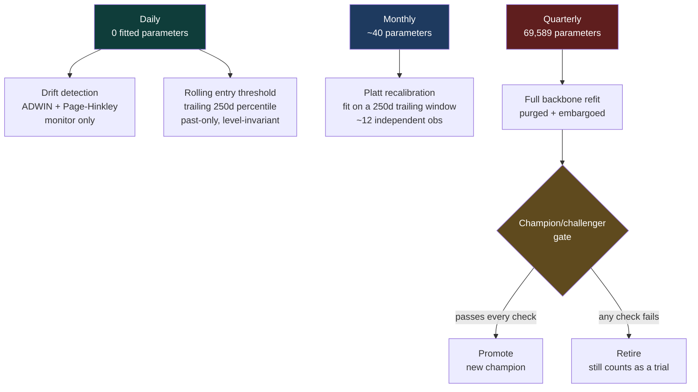

# 10. Adaptive Retraining

How the system adapts to a changing market without manufacturing an edge that
was never there.

## The design rule: layer by parameter count, not by clock

The obvious design is "retrain often, on a fast clock." That is wrong here, and
the arithmetic says why.

A forward label at horizon `h` resolves `h` days later, so daily samples overlap
`h`-fold. The **independent** information arriving per period is roughly
`days / h`:

| Cadence | New samples | Independent obs (h=20) |
|---------|-------------|------------------------|
| Daily | 1 | 0.05 |
| Weekly | 5 | 0.25 |
| Monthly | 21 | 1.05 |
| Quarterly | 63 | 3.15 |
| Yearly | 252 | 12.6 |

The backbone has **69,589 parameters**. A weekly gradient update would fit those
against a quarter of one independent observation — roughly 280,000 parameters per
observation. That is not adaptation, it is noise injection, and next week it gets
overwritten by different noise.

So each layer's **parameter count is matched to the data its cadence delivers**:



Note what is **not** here: per-sample online learning (FSNet, OneNet, incremental
SGD). Those are excellent methods, and they are built for high-frequency streams.
At ~250 observations a year there is nothing for a fast adapter to consume. They
become appropriate the moment intraday data arrives — which is the same change
that fixes the effective-sample-size problem generally.

## Layer 1 — drift detection (daily, monitors only)

`Source/Adaptive/drift.py`. Two complementary detectors, implemented in-repo so
the daily CI job keeps a small dependency set.

| Detector | Catches | Mechanism |
|----------|---------|-----------|
| **ADWIN** | gradual distribution change | keeps a window; cuts it whenever two halves' means differ by more than a Hoeffding bound |
| **Page-Hinkley** | abrupt level shifts | cumulative deviation from the running mean; alarms when it departs from its own minimum |

**These never trigger a retrain.** An alarm is evidence to inspect, not
permission to act. At ~250 observations a year, one firing cannot be
distinguished from a false alarm.

This layer exists because the project was already bitten by undetected drift: the
frozen validation entry threshold went degenerate on test when the signal's level
shifted (validation mean 0.00 vs test −0.79), and the rule stopped trading
entirely. That was found by accident. Now it is measured.

### Calibrating the detectors honestly

Both thresholds were set **empirically, not by taste**. Over 40 runs of
stationary N(0,1) input versus a 3σ shift at t=300:

| Detector | Setting | False positives | Detection |
|----------|---------|-----------------|-----------|
| ADWIN | δ = 0.002 | 0 / 40 | 40 / 40 |
| Page-Hinkley | λ = 80 | 0 / 40 | 40 / 40 |

Page-Hinkley's first implementation used an **unstandardised** cumulative sum,
whose range grows like √T. It fired on every stationary run — a false-alarm
generator that looks exactly like real drift. The fix was to standardise the
input by a running standard deviation (Welford) before accumulating, then pick
the smallest λ with zero false alarms. A regression test now asserts both
properties: fires on a shift, silent on stationary data.

### What it found on the live signal

Over 924 out-of-sample days: **ADWIN 11 alarms, Page-Hinkley 1**. The largest are
real and large — 2023-12-19 (−1.03 → −3.43) and 2024-04-16 (−3.04 → −0.58). The
signal's *level* moves substantially over time. That vindicates the past-only
rolling threshold and confirms the fixed-threshold failure was structural, not a
one-off.

## Layer 2 — model versioning and provenance

`Source/Adaptive/versioning.py`. This is the prerequisite for any retraining, and
it must exist **before** the first refit.

Today the paper book is honest because one model is frozen with its cutoff
stamped in metadata, so no traded day can be in-sample. Once models are retrained
on a schedule, that guarantee has to be rebuilt: a prediction is out-of-sample
only with respect to **the model that actually produced it**.

Every version records:

| Field | Purpose |
|-------|---------|
| `train_cutoff` | last date fitted on. Prediction for date D is OOS iff `D > train_cutoff` |
| `trial_index` | cumulative count of models ever trained in this lineage |
| `parent` | the version it challenged, so lineage is reconstructable |
| `status` | champion / challenger / retired |

`assert_out_of_sample()` **raises** rather than warns — a silently in-sample
prediction invalidates every number downstream of it.

Rejected challengers are **kept, never deleted**. The count of rejects *is* the
trial count that deflates the Sharpe.

## Layer 3 — decision-layer recalibration (monthly, ~40 parameters)

`Source/Adaptive/recalibrate.py`. Two Platt coefficients per horizon.

The critical detail is **what it fits on**:

```
40 parameters on a 250-day trailing window  ->  ~12 independent obs   (used)
40 parameters on the 21 new days            ->  ~1  independent obs   (refused)
```

And the window must end **`horizons` days before** the prediction date, because a
label for horizon `h` only resolves `h` days later. Fitting up to the prediction
date would calibrate on the very move being predicted. `recalibrate_at()`
enforces this embargo, and a test asserts `fit_end_index == t - horizon_max`.

The entry threshold is deliberately **not** refit here. It is already a past-only
rolling percentile with zero fitted parameters — the correct fast-adaptation
design at this data rate, and the thing that survived the level shift.

## Layer 4 — quarterly refit behind a champion/challenger gate

`Source/Adaptive/retrain.py`. The only layer permitted to touch the network, and
it refits from scratch rather than nudging the incumbent — at ~3 new independent
observations per quarter there is nothing to nudge with.

### The gate fails closed

Every condition must pass. Anything that **cannot be evaluated counts as a
failure**, never a pass.

| Check | Requirement |
|-------|-------------|
| Resolvability | eval block must carry ≥ `min_effective_n` (30) independent obs |
| Improvement | gain ≥ max(`min_improvement`, `promote_z` × SE of the difference) |
| Deflation | deflated Sharpe ≥ 0.95 at the lineage trial count |
| Embargo | `embargo_days` ≥ `horizons`, enforced at startup |

### A bug this design caught in its own first run

The first version of the gate used only a fixed `min_improvement: 0.01`. It
promoted a challenger on **+0.0786 mean AUC** — which looks decisive until you
read the rest of the row:

| | Champion | Challenger |
|---|---|---|
| Mean AUC | 0.4466 | 0.5251 |
| **Primary-horizon AUC** | **0.6920** | **0.4110** |
| SE on AUC | 0.25 | 0.27 |
| **Effective n** | **5.3** | **5.3** |

A 0.0786 difference against a 0.25 standard error is **0.3σ** — noise. The
challenger was actually *worse* on the horizon that gets traded. And
`promote_requires_dsr: true` silently did nothing, because no return series was
passed and the check was skipped rather than failed.

Both are fixed and both are regression-tested. With the corrected gate the same
challenger is **rejected**:

> evaluation block carries only 5.3 independent observations (minimum 30); no AUC
> difference measured here is distinguishable from noise, so no promotion is
> justified

This is the whole point of the layer. A retraining schedule without a
statistically honest gate is a machine for manufacturing edges: retrain often
enough, keep whatever looks best, and 0.51 becomes 0.58 with no real signal added
anywhere.

## Running it

```bash
# audit: drift + provenance + recalibration simulation. Trains nothing.
python -m Source.Adaptive.run

# additionally train a challenger and run it through the gate
python -m Source.Adaptive.run --retrain
```

Writes `frontend/public/data/adaptive.json`. The daily CI job runs the **audit
form only** — the quarterly refit is a deliberate act, not a cron job, precisely
because each run is a trial that must be counted.

## Configuration

```yaml
adaptive:
  drift:
    detectors: [adwin, page_hinkley]
    adwin_delta: 0.002        # 0 false positives, 40/40 detection
    ph_lambda: 80.0           # smallest lambda with 0 false alarms
  recalibration:
    every_days: 21            # ~monthly
    window_days: 250          # trailing window (~12 indep obs)
  retrain:
    every_days: 63            # ~quarterly
    embargo_days: 20          # must be >= horizons
    eval_days: 126
    min_improvement: 0.01     # floor; the real bar is promote_z x SE
    promote_z: 1.96
    min_effective_n: 30       # refuse to judge below this
    promote_requires_dsr: true
```

## Honest limits

- **The eval block is currently too small to promote anything.** 126 days is 6.3
  independent observations at h=20, below the 30 minimum. That is the correct
  answer, not a bug: the system refuses to make a decision it cannot support.
  Promotion needs ~600 days of evaluation, which is years of daily data.
- **Adaptation cannot create an edge.** Every layer here adapts a model whose
  mean AUC is 0.5123 with 0/20 horizons significant. Adapting no-edge faster
  produces no edge faster.
- **The drift alarms are descriptive, not actionable.** They say the signal's
  level moves. They do not say a retrain would help.
- **This is a scaffold for when the data improves.** With intraday data, the
  effective-n arithmetic changes by 1-2 orders of magnitude, the gate becomes
  able to resolve real differences, and layers 4-5 of the original ladder
  (FSNet-style continual learning) become worth building.

Back to the [index](README.md).
