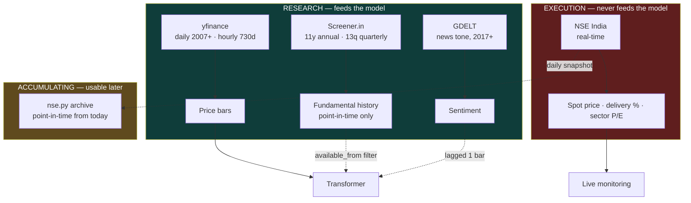

# 13. Data Sources and Routing

Five free sources, each authoritative for something different. Using the wrong
one is not a style choice — it changes the numbers, and in two cases it silently
manufactures alpha.

## The routing rule



**The hard line: nothing in the LIVE box may ever reach the model.** A live quote
has no history to train on, and a current fundamental applied backwards is
look-ahead leakage.

## Source comparison

| Source | Key? | History | Feeds model? | Authoritative for |
|--------|------|---------|--------------|-------------------|
| **yfinance** | no | daily 2007+, hourly 730d | **yes** | price bars, macro series |
| **Screener.in** | no | 11y annual, 13q quarterly | **yes, lagged** | fundamental history, FII/DII |
| **GDELT** | no | 2017+ | **yes, lagged** | news tone |
| **NSE India** | no | none (today only) | **no** | live price, delivery %, sector P/E |
| NewsAPI | yes | ~30 days | **no** | — superseded by GDELT |

## Why each is routed where it is

### yfinance → historical bars

Depth. Daily `^NSEI` back to 2007 and hourly back 730 days. NSE's public
endpoints do not serve deep history at all, so there is no alternative for the
thing the model actually trains on.

**The throttling trap.** Yahoo answers an overloaded request with an **empty
body**, not an error, and yfinance caches that emptiness on the client — so a
plain retry re-reads the same nothing. `session.download()` therefore builds a
**fresh curl_cffi Chrome-impersonating session per attempt** and **raises** rather
than returning empty. A silent empty frame becomes a silent gap in a training set.

### NSE India → live only

Authoritative and real-time, which yfinance is not: `history()` returns only
**settled** daily bars, so mid-session its last close is *yesterday's*.

It also carries **`delivery_pct`** — the share of traded quantity actually
settled rather than squared off intraday. That is a genuine microstructure signal
(positional conviction vs speculative churn) and is **unavailable from yfinance
entirely**.

But NSE serves only *today's* values, so it cannot feed a backtest. `nse.py`
therefore **archives** a dated snapshot per run, building a point-in-time panel
going forward. `archive_span()['usable_as_features']` stays `False` until 250+
distinct dates exist, making "is this safe to train on" a mechanical check.

NSE blocks datacenter IPs — works from an Indian connection, fails on CI.

### Screener.in → fundamental history, with a mandatory lag

The only source here with real fundamental history, and the one that removes the
"no free point-in-time fundamentals" blocker documented since the cross-sectional
track was written.

**The reporting lag is the whole point.** A quarter *labelled* "Mar 2026" **ends**
2026-03-31 and is **announced** around 2026-05-15. Using its revenue on April 1st
tells the model something the market did not know.

| Statement | SEBI deadline | Applied |
|-----------|---------------|---------|
| Quarterly results | Reg 33 | **+45 days** |
| Annual results | Reg 33 | **+60 days** |
| Shareholding | Reg 31 | **+21 days** |

Deadlines are taken **at the limit**, not the typical case — assuming a company
reported early is exactly the optimistic assumption that produces phantom alpha.
Every row carries `available_from`; `point_in_time()` filters on it. **Filtering
on the period label is the leak this module exists to prevent.**

Verified on real data:

```
as of 2026-04-01  ->  sees Dec 2025   (Mar 2026 not yet public)
as of 2026-05-20  ->  sees Mar 2026   (announced 2026-05-15)
```

### GDELT → sentiment that can be backfilled

NewsAPI's free tier serves ~30 days. A feature built from it exists for 30 of
~4,600 training days, so training on it zero-fills 99% of history — **inventing**
a feature rather than adding one. That path stays off.

GDELT is free, keyless, and reaches back to 2017. Three operational realities:

1. **Resolution scales with the window.** A 60-day request returns ~60 points —
   *daily* tone, not 15-minute. Finer needs smaller chunks and proportionally
   more requests.
2. **It rate-limits hard**, so a 730-day backfill will not finish in one pass.
   Every chunk saves as it arrives and `--resume` skips what is on disk. Re-run
   it; each pass makes strict progress.
3. **An unparenthesised `OR` query returns HTTP 200 with a text error body**, so
   a malformed query looks like a successful empty result. The client raises.

Leakage: `merge_asof(direction="backward")` **then** `.shift(1)`. Both steps are
required — GDELT timestamps are *publication* times, so a 10:00 story can
describe a 09:50 move.

## What is deliberately NOT here

**A sample-data fallback.** A source module this project borrowed from serves
embedded sample prices when the network fails, badged `source: "sample"`. That is
good UX in a demo app and a **correctness disaster** here: a backtest would train
on fabricated prices and report the resulting AUC and Sharpe as real. Fetches
fail loudly instead.

**Screener's current ratios and per-stock statement plumbing.** Well built, but
it serves a stock-research UI. This project forecasts index direction, and those
fields carry the same current-snapshot leakage risk without the history that
makes the panel useful.

## Running them

```bash
# research inputs
python -m Source.Ingestion.Fetch_Market_Data          # ^NSEI daily
python -m Source.Ingestion.fetch_macro                # VIX, USDINR, crude, S&P
python -m Source.Ingestion.fetch_universe             # 85 NSE names
python -m Source.Intraday.fetch --interval 1h         # hourly bars
python -m Source.News.gdelt --days 730                # news tone (re-run to fill)
python -m Source.Ingestion.screener --limit 85        # point-in-time fundamentals

# execution-side / accumulating
python -m Source.Ingestion.quotes --indices           # live index levels
python -m Source.Ingestion.nse                        # archive today's snapshot
python -m Source.Ingestion.screener --status          # panel coverage
```

## Trading calendar

`session.py` holds the NSE holiday list. Nothing in the project knew holidays
existed before it, so `market_open` was wrong on Diwali and every trading-day
count was inflated: **October 2026 has 18 trading days, not the 22** a weekday
count returns — an 18% error in anything annualised per trading day.

`calendar_covers(start, end)` reports when a range falls outside the known years
rather than silently degrading to weekends-only.

## Honest limits

- **Survivorship is unfixed.** Screener publishes pages for *currently listed*
  companies. Delisted, merged and collapsed names are absent, so any panel built
  from it over-represents winners.
- **NSE's archive starts today.** It cannot backfill; it only accumulates.
- **GDELT coverage is partial** (~89% of 730 days after several passes) and
  daily-resolution at practical chunk sizes.
- **None of this has produced an edge.** Better plumbing raises the ceiling on
  what *could* be measured; it does not create signal.

Back to the [index](README.md).
